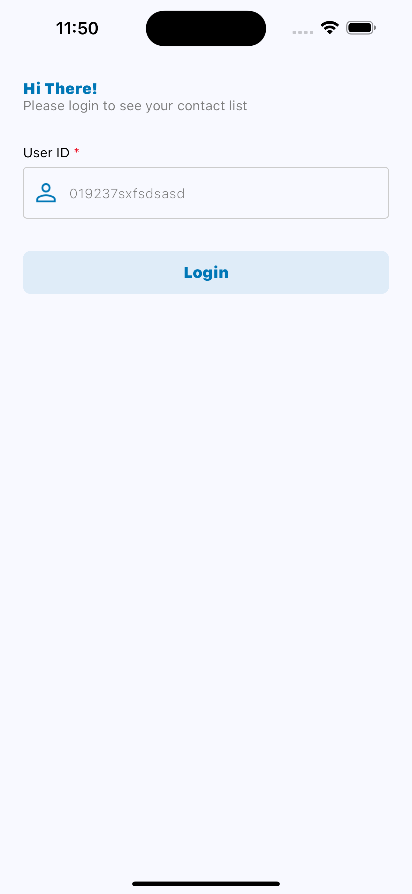
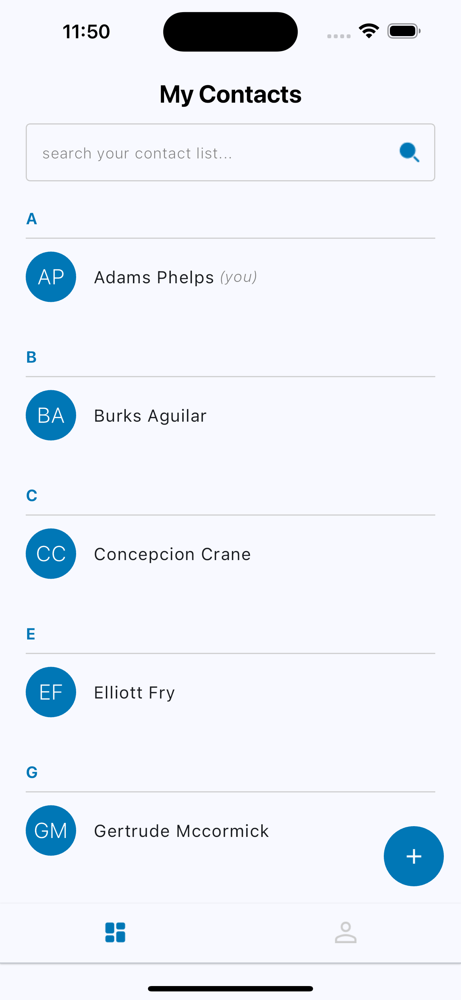
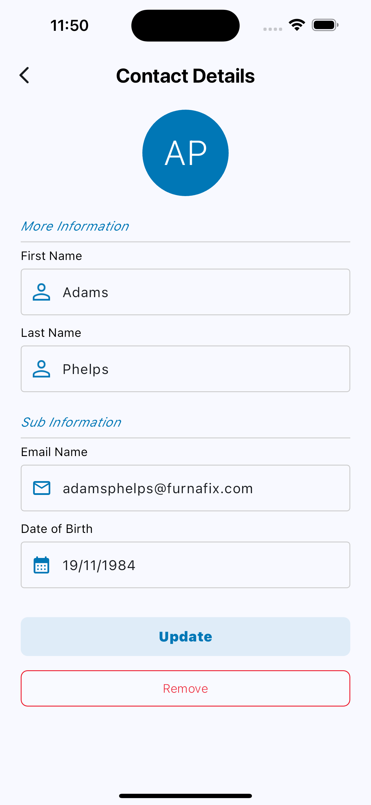
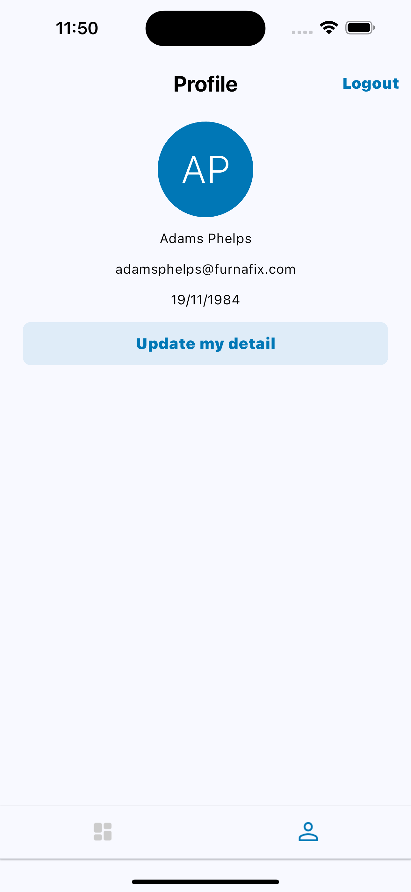

# Flutter Contacts App

A simple app to create and view your contact list.

## How to start | Installation
### Prerequisites
- [Flutter](https://docs.flutter.dev/get-started/install)
- Android emulator (for mobile)

### Clone the Repository
```bash
git clone https://github.com/pandaling/flutter_contacts_app.git
```

### Install dependencies
```bash
# Make sure you already in the root directory
cd flutter_contacts_app

# Install
flutter pub get
```

### Screenshots

#### IOS



